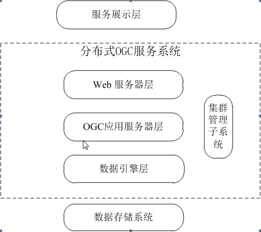

# 第一章 绪论
## 1.1 研究背景与意义
* 地理信息系统(Geographic Information System, GIS)是处理数字化空间数据的计算机应用系统，是一门以地理学为基础理论依据、以计算机科学为基数支撑、以遥感和GPS为重要数据源的综合性交叉学科，GIS对地理数据进行生成、管理和分析，并在此基础上提供决策分析。目前，随着计算机技术和网络通信技术的迅速发展，GIS为人们提供了一种在全球范围发布和获取信息的新手段。伴随着经济的快速增长与社会各行业的对地理信息需求的日益旺盛，地理信息信息产业正在显现出无限广阔的发展前景与巨大的市场潜力。GIS是一种多学科交叉的产物,它是一个采集、存储、管理、分析、描述和应用整个或部分地球表面（包括大气层在内）与空间和地理分布有关数据的计算机系统。随着全球信息化进程的加快，GIS正从传统的封闭的单机模式向开放和共享的网络化、分布式GIS方向发展，在Internet网络上实现空间信息的发布与共享，已经逐渐成为GIS发展的必然的趋势。
* OGC-Web 服务通用标准  (__TODO__)
* 近年来 ,不同部门、不同行业通过遥感、航摄 、GPS、LIDAR 、传统测绘等生产了海量的二维、三维空间地理数据,建立了大量的空间地理信息系统和空间数据库。但是由于空间地理数据的多样性和复杂性,传统的表现方法缺陷日益凸显。各个系统彼此封闭、孤立、缺乏统一标准 ,不同的数据格式、数据结构、存储方法,数据系统和“孤岛数据库”难以实现信息共享和交流,无法实现空问地理信息数据和服务的最大共享。而Web Services 的引入将能改变GIS数据访问的网络互操作，实现真正的网络环境下的空间地理信息共享. 互联网上大量的信息资源多数具有空间分布的特性，利用WebGIS对这些信息进行管理，为用于提供基于空间分布的多种信息服务，提高资源的利用率和共享程度。
* W*S 服务的介绍  (__TODO__) 

## 1.2 国内外的研究背景

* 不同的WebGIS平台具有多样性，其所存储的地图数据结构也有可能不一致，即数据之间存在存储的异构性。针对以上问题，只有选择一种与存储和平台无关的技术才能实现统一、规范和标准的地图数据交换与共享方式。网络地图服务是一种融合分布式网络、计算机图形学、网络服务（WebService）和空间数据库于一体的用于存储、处理和共享地图数据的高新技术，其采用HTTP协议访问与传输数据，与传输两端系统和平台无关，因此，网络地图服务成为WebGIS间地图数据共享的主要途径。在多个WebGIS之间，网络地图数据把地图数据的相关属性与WebService结合起来，根据实际需求，灵活准确地为开发者提供地图数据渲染、分析和可视化表达等一系列接口。开发者基于网络地图服务进行二次开发，辅助决策或实现其他业务功能。目前，网络地图服务已经成为WebGIS中必不可少的基础服务，以其为基础的软件和解决方案正逐步渗透到生产生活中的各个领域，可靠、便捷的网络地图服务正成为WebGIS发展的重要方向之一。
* 目前，国内外各大公司研制的WebGIS产品中均提供网络地图服务，采用这种服务可以接入Internet提供的网络地图数据，纵使本地没有存储地图数据也可以快速、方便的完成浏览与分析功能，例如国外MapInfo的MapXtreme，ESRI的ArcGIS，Autodesk的MapGuide，Intergraph的GeoMedia WebMap以及开源的GeoGIS等，国内的SuperMap GIS、MapGIS、Citystar等都良好的实现了该类服务。
虽然网络地图服务的发展取得了长足的进步，但是还存在以下不足：

```
1） 服务中地图发布流程固定，定制性不强；
2） 网络地图服务发布的地图数据源支持格式有限，扩展性不强；
3） 以上产品间的服务中数据交换虽然有一定标准，但仍存在不兼容现象；
4） 某些领域的地图数据存储格式和交换具有特殊标准，以上产品更是无法兼容；
5） 以上大多产品为商业产品，通常需要高昂的服务和维护费用，而一部分开源产品在效率上又达不到要求。
因此，开发一款WebGIS产品，实现定制性与扩展性兼备，并且符合特殊领域地图数据存储和交换标准的网络地图服务系统是必要的。
```
## 1.3 论文的主要工作与章节安排
* 论文的章节安排如下：
* 本文主要阐述了实现高性能分布式的符合OGC标准的GIS服务,设计了由Web服务器、OGC应用服务器层、数据引擎层 三层架构组成的符合OGC标准的GIS服务。重点阐述了OGC应用服务器层的实现过程，并测试与分析了服务的稳定性和并发性。总结论文所做的工作，主要为：

----

1. 第一章为绪论部分，简单介绍了课题的研究背景、地理信息系统的发展现状、OGC标准服务规范、分布式OGC服务的三层架构。指出多WebGIS间地图数据交换共享所存在的问题以及相应地解决方案，重点阐述了如何实现高效稳定的分布式OGC应用服务器。
2. 第二章，详细介绍了分布式OGC服务的三层架构，介绍了每层架构的主要功能和相互之间的关联，以及对服务用到的相关技术进行了简单介绍，包括分布式对象中间件Ice、IO模型、内存管理。
3. 第三章，详细介绍了高性能OGC应用服务器的实现，核心阐述了如何实现高效而稳定的服务端。第一,介绍了如何基于分布式对象中间件Ice实现OGC应用服务器层，以及详细对比了几种不同的服务框架模型，列出了各自的优缺点；第二,在服务实现中重点阐述了如何实现高效的内存管理;第三,介绍了服务的预处理技术，从而提高服务的性能和并发性。
4. 第四章，详解介绍了分布式OGC应用服务器端的负载均衡的实现，对比了几种不同策略的负载均衡，并设计了OGC应用服务器层的自动发布和更新过程。？
5. 第五章，详细介绍了分布式OGC应用服务器端的集群监控，在分布式对象中间件Ice开源框架提供的基础上，设计了自己的集群监控功能，可以控制服务集群的负载均衡策略，监控各个服务器节点的负载信息，控制各个服务器节点上的每个服务的开启和关闭。
6. 第六章，总结与展望部分，概述系统实现的主要功能，总结了课题研究过程中所做的工作、成果和未来的研究方向。


# 第二章 分布式OGC服务
## 2.1 服务总体框架结构和功能
* 分布式OGC服务采用Web服务器层、OGC应用服务器层、数据引擎层三层架构组成，采用 Ice 中间件处理应用逻辑，按照 SOA 组建模型的思想，为各种用户提供都中服务OGC标准的地理信息服务。服务的架构图如下2.1:

* 分布式OGC服务采用分层结构，遵循设计模式中的"高内聚、低耦合"的思想。在各种 Web 服务中，这种分层模式的思想都被广泛应用。分层使不同的开发人员关注各自擅长的特定层面，有助于开发优质的系统。分层分离了逻辑，使得系统结构层次明晰，系统变得灵活和易于维护，有助于构建良好的系统。图2.1中: 


## 2.2 OGC服务系统各层功能
	OGC系统服务由 Web服务器、 OGC应用服务器层、数据引擎层 这三层架构组成。这种分层架构的模式被广泛用于传统的
	
* __服务展示层__ 是为了更好的演示整个分布式 OGC 服务，主要用于对外发布数据中心提供的、用户可读的 Web 服务，同时提供服务分类列表、服务关键字检索，并展现服务更新情况、描述服务与示例等。普通用户或者负责二次开发的专业用户可以通过服务展示层获取 OGC 服务系统提供的各类服务的详细功能说明、编程接口说明和功能演示。
* __Web服务层__ 
	
## 2.2 Web服务器层
* 功能展示
* 服务组合
* 派发请求
* 一级负载均衡
* __TODO__

## 2.3 OGC应用服务器层

## 2.4 数据引擎层


## 第三章 高性能 OGC 应用服务器实现
	根据第二章 Ice 通信模型的介绍可知，Web服务器层和OGC应用服务器层之间通过分布式对象中间件 Ice 进行通信，使用接口描述语言 Slice 定义通信规则。Web服务层通过 slice2java 编译 slice 文件生成 Ice proxy 类与代理方法接口，OGC 应用服务器层通过 slice2cpp 编译 slice 文件生成 Ice 骨架类 C++ 代码。应用服务器层通过继承骨架类，实现每个服务体。OGC应用服务器层的每个服务操作计算的过程，见下列流程图。
	
### 3.1 OGC几种服务实现
	服务的数据流图
	状态图                                                                                                                                             

### 3.2 服务框架模型
	在网络编程中，阻塞、非阻塞、同步、异步经常被提到。同步和异步是针对功能的执行顺序来说的，而阻塞和非阻塞是针对等待IO数据的方式说的。因此这是两对概念，同步与阻塞，异步与非阻塞没有必然的联系。同步就是工作线程在处理IO时等待IO完成再继续后面的工作；异步就是工作线程不等待IO处理的结果就继续后面的工作，而IO处理结果将通过回调的方式返回；阻塞是在等待IO时，如果IO没有可用数据或数据没有传送完成，那么一直等待下去，直到IO处理完数据再返回；非阻塞就是不管IO是否有可用数据或数据已经传送，照样返回。只要把同步和阻塞分清，这四个概念就很容易理清了。
	同步、异步、阻塞、非阻塞等原理确定了网络通信的基本网络通信模型结构。它们处理的怎么等待数据和怎么收发数据的问题，特别是服务端，当成千上万的连接发生并发时，降低cpu的占用率，减少内存使用率，减少带宽就成为了很关键的问题。同步和异步关注的是消息通信机制 (synchronous communication/ asynchronous communication)。所谓同步，就是在发出一个"调用"时，在没有得到结果之前，该"调用"就不返回。但是一旦"调用"返回，就得到返回值了。换句话说，就是由"调用者"主动等待这个"调用"的结果。而异步则是相反，"调用"在发出之后，这个调用就直接返回了，所以没有返回结果。换句话说，当一个异步过程调用发出后，调用者不会立刻得到结果。而是在"调用"发出后，"被调用者"通过状态、通知来通知调用者，或通过回调函数处理这个调用。	
#### 3.2.1 同步模型
* 通过使用远程过程调用，远端服务调用变得像传统的方法调用一样容易，现代中间件技术力图减轻程序员在转向分布式应用开发时的负担：你调用某个对象上的方法，当该方法完成时，就会返回结果，或是抛出异常。当然，分布式系统中，对象的实现可能会驻留在另一个主机上，从而带来一些语义上的差异，程序员必须加以注意，比如远程调用的开销，以及可能发生与网络有关的错误。尽管有这样一些问题，程序员的面向对象编程经验仍然是有用的，上述的同步编程模型（发出调用的线程会阻塞到操作返回）是我们所熟悉和容易理解的。
* 同步模型的服务流程图
* 同步模型的优点：编程实现简单，每一种服务的每一个请求调用就是一次远程过程调用，服务器端处理完此次调用直接将结果返回或抛出异常。
* 同步模型的缺点：同步模型下，服务器端的并发量收到限制，服务端Ice的每个接收请求的线程不仅要接受客户端发过来的调用请求，还要负责每次调用请求的处理逻辑。不仅客户端的调用请求会一直阻塞住等待返回，服务器端的接收线程在每一次调用过程中阻塞时间过长，当并发量和接收线程池内的线程数量相当时，接收线程资源很容易就被耗尽，从而无法满足更多的并发请求

#### 3.2.2 异步模型
* Ice 在本质上是一个异步的中间件平台,出于对应用 (及其程序员)的 考虑而模拟了同步的行为。当 Ice 应用通过代理、向远地对象发出同步的双 向调用时,发出调用的线程会阻塞起来,以模拟同步的方法调用。在此期间，Ice run time 在后台运行,处理消息,直到收到所需的答复为止,然后 发出调用的线程就可以解除阻塞,解编结果了。但是,在许多情况下,同步编程的阻塞本质太过受限。例如,在等待远 地调用的响应返回时,应用本来可以另外做一些工作;在这样的情况下使 用同步调用,应用就会被迫把工作推后、等待响应返回,或是在另外一个 线程中执行该工作。如果这些做法都不可接受, Ice 的异步设施提供了一种 有效的解决方案,可以改善性能和可伸缩性,或是简化复杂的应用任务。
* 一个服务器在同一时刻所能支持的同步请求数受到 Ice run time 的服务器线程池的尺寸限制。如果所有线程都在忙于分派长时间运行的操作,那么就没有线程可用于处理新的请求,客户就会经常处于不可接受的无响应状态。异步模型有两种概念: __异步方法调用__ 和 __异步方法分派__ .
* __异步方法调用__: 异步方法调用(AMI)这个属于描述的是客户端的异步编程模型支持。如果使用AMI发出远地调用，在Ice run time 等待答复的同时，发出调用的线程不会阻塞,相反，发出调用的线程可以继续进行各种搞活动，当答复最终到达时，Ice run time会通知客户端应用。
* __异步方法分派__: 一个服务器在同一时刻所能支持的同步请求数受到 Ice run time 的服务器线程池的尺寸限制。如果所有线程都在忙于分派长时间运行的操作,那么就没有线程可用于处理新的请求,客户就会经常处于不可接受的无响应状态。异步方法分派（AMD）是AMI的服务器端等价物，能够解决这个可伸缩性问题。在使用 AMD 时,服务器可以接收一个请求,然后挂起其处理, 以尽快释放分派线程。当处理恢复、结果已得出时,服务器要使用 Ice run time 提供的回调对象,显式地发送响应。AMD操作通常会把氢气数据（也就是，回调对象和操作参数）放入队列中，供应用的某个线程（或线程池）随后处理用，这样，服务器就是分派线程的使用率降低限度，能够高效地支持数千并发客户。
#### 3.2.3 线程池会话模型
#### 3.2.4 线程池会话+异步回调
	
### 高效的内存管理
1. 内存池
2. 内存环形缓冲区(大批量数据，内存不够的情况)
3. 内存泄露和检测以及处理
	
### 服务的预处理
1. 预热缓存(初始化服务后，模拟一些请求概率高的请求来预热缓存)
2. 实现建立数据库连接(服务过程中线程动态维护连接)
3. 周边渲染（结果存入缓存集群中）
	
## 第四章 应用层负载均衡的实现
1. 基于 RR_DNS 的负载均衡 
2. 基于应用层负载均衡 
3. 基于网络层和链路层的负载均衡（LVS）
4. 如何实现 WMS 的预渲染:
	
	这个会破坏所有服务器一致性，让每个服务有状态。 解决方案：利用 memcached 缓存集群, 将预渲染出来的结果缓存在这里面，当下一次请求过来的时候可以直接从缓存集群中获取数据，缓存集群和服务集群是两个独立的集群.


## 第五章 应用服务器的集群监控
1. 开源的集群监控工具
2. IceGridAdmin 集群监控(获取集群信息，控制集群)
3. 实现集群监控服务 + 可视化页面
4. 缓存机制

## 第六章 总结与展望 
